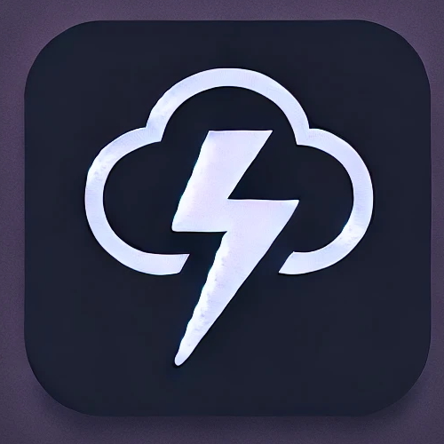

# Storm ⚡ 

CMSI 3802: Languages and Automata II

## Introduction

Storm is a high-level, object oriented programming language brought to you by Jack Seymour, Lydia Worku, Gavin Butts, Jackie Bowers, and Maria Dominguez. This language was created for young children who are learning how to code. This easy-to-learn language is also helpful for any beginning programmers.

## Features

## Examples of Programs
